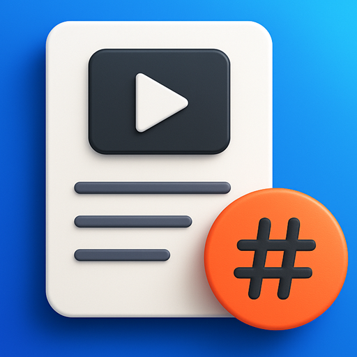

# 📱 Linkcim v1.0.0

<div align="center">



**🚀 Instagram, YouTube, TikTok, Twitter(X) videolarını indir, kategorize et ve organize et!**

[](https://flutter.dev/)
[](https://developer.android.com/)
[](https://github.com/mehmetkaratslar/linkcim/releases)


</div>

## ✨ Özellikler

### 🤖 **AI Destekli Analiz Sistemi**
- **Akıllı Video Analizi**: OpenAI GPT ile otomatik başlık, kategori ve etiket önerileri
- **Platform Metadata**: Instagram, YouTube, TikTok, Twitter(X) için otomatik bilgi çekme
- **Kullanıcı Başına 10 Ücretsiz Analiz**: Kendi API key'inizi ekleyerek sınırsız kullanım

### 📥 **İndirme Sistemi**
- **Çoklu Platform Desteği**: Instagram, YouTube, TikTok, Twitter(X)
- **Yüksek Kalite İndirme**: En iyi kalitede video indirme
- **Otomatik Galeri Kaydı**: İndirilen videolar otomatik olarak galerinize kaydedilir
- **İndirme Progress**: Gerçek zamanlı indirme durumu gösterimi

### 🎨 **Modern UI/UX Tasarımı**
- **Material Design 3**: Modern ve şık arayüz
- **Gradient Butonlar**: Renkli ve çekici buton tasarımları
- **Kart Tabanlı Düzen**: Temiz ve organize görünüm
- **Responsive Tasarım**: Tüm ekran boyutlarında mükemmel görünüm

### 🔍 **Gelişmiş Arama ve Organizasyon**
- **Arama**: Başlık, yazar, platform, etiket araması
- **Kategori Sistemi**: Videolarınızı kategorilere ayırın
- **Etiket Sistemi**: Özel etiketlerle videolarınızı organize edin
- **Video Önizleme**: Gerçek video thumbnail'ları
- **Platform Metadata**: Instagram, YouTube, TikTok, Twitter için otomatik bilgi çekme

### 📱 **Kullanıcı Dostu Özellikler**
- **Video Paylaşma**: Sosyal medyada kolayca paylaşın
- **Video Çalma**: Uygulama içinde video oynatma
- **Offline Çalışma**: İnternet olmadan videolarınıza erişin
- **Çoklu Dil Desteği**: Türkçe ve İngilizce
- **Tema Desteği**: Açık, koyu ve sistem teması

## 📸 Ekran Görüntüleri

<!-- Merkezde, yan yana, küçük görseller -->
<p align="center">
  
  &nbsp;&nbsp;
  
  &nbsp;&nbsp;
  
</p>

<p align="center">
  <b>Ana&nbsp;Sayfa</b>&nbsp;&nbsp;&nbsp;&nbsp;
  <b>Video&nbsp;Ekleme</b>&nbsp;&nbsp;&nbsp;&nbsp;
  <b>İndirme&nbsp;Geçmişi</b>
</p>


## 🚀 Kurulum

### 📱 **Android APK Kurulumu**

1. **GitHub Releases**'den en son APK'yı indirin en güncel versiyon Linkcim v1.0.0'dir:
   [https://github.com/mehmetkaratslar/linkcim/releases/latest](https://github.com/mehmetkaratslar/linkcim/releases/tag/v1.0.0)
   
2. **APK'yı telefonunuza yükleyin**:
   - APK dosyasını telefonunuza alın
   - Ayarlar > Güvenlik > Bilinmeyen Kaynaklardan yüklemeye izin verin
   - APK dosyasına tıklayıp yükleyin

### 🛠️ **Geliştirici Kurulumu**

```bash
# Repository'yi klonlayın
git clone https://github.com/mehmetkaratslar/linkcim.git

# Proje dizinine gidin
cd linkcim

# Bağımlılıkları yükleyin
flutter pub get

# Uygulamayı çalıştırın
flutter run
```

## 🎯 Kullanım

### 1. **Video Ekleme**
- Ana sayfada "+" butonuna tıklayın
- Video URL'sini yapıştırın (Instagram, YouTube, TikTok, Twitter)
- Başlık, kategori ve etiketleri girin
- **Kaydet** butonuna tıklayın

### 2. **Video Arama**
- Ana sayfada arama çubuğunu kullanın
- Başlık, yazar, platform veya etiket ile arama yapın
- Kategori filtrelerini kullanarak sonuçları daraltın

### 3. **Video İzleme ve Paylaşma**
- Video kartına tıklayarak videoyu görüntüleyin
- **Oynat** butonuyla videoyu izleyin
- **Paylaş** butonuyla sosyal medyada paylaşın

## 🛡️ Güvenlik ve Gizlilik

- **Yerel Depolama**: Tüm verileriniz cihazınızda güvenle saklanır
- **Gizlilik**: Kişisel bilgileriniz hiçbir yere gönderilmez
- **Açık Kaynak**: Kod tamamen açık ve incelenebilir

## 🌟 Öne Çıkan Özellikler v1.0

### ✨ **Temel Özellikler**
- 🎨 **Modern UI Tasarımı** - Material Design 3 ile şık arayüz
- 🌍 **Çoklu Dil Desteği** - Türkçe ve İngilizce
- 🌓 **Tema Desteği** - Açık, koyu ve sistem teması
- 🖼️ **Gerçek Thumbnail'lar** - Video kapakları görüntüleniyor
- 📱 **Çoklu Platform Desteği** - Instagram, YouTube, TikTok, Twitter, Facebook, Vimeo, Reddit
- 📁 **Video Koleksiyonları** - Videoları özel koleksiyonlara organize edin
- 🔍 **Gelişmiş Arama** - Platform, kategori, etiket ve tarih filtreleri ile güçlü arama

### 🔧 **Teknik Özellikler**
- ⚡ **Yüksek Performans** - Hive veritabanı ile hızlı çalışma
- 🎯 **Kullanıcı Dostu** - Basit ve sezgisel arayüz
- 📱 **Responsive Tasarım** - Tüm ekranlarda mükemmel görünüm
- 🔒 **Güvenli Depolama** - Tüm veriler yerel olarak saklanır

## 🤝 Katkıda Bulunma

Katkılarınızı memnuniyetle karşılıyoruz! 

1. Repository'yi fork edin
2. Feature branch oluşturun (`git checkout -b feature/amazing-feature`)
3. Değişikliklerinizi commit edin (`git commit -m 'Add amazing feature'`)
4. Branch'inizi push edin (`git push origin feature/amazing-feature`)
5. Pull Request oluşturun


## 📞 İletişim

- **Geliştirici**: Mehmet Karatslar
- **GitHub**: [@mehmetkaratslar](https://github.com/mehmetkaratslar)
- **Email**: [İletişim](mailto:mehmetkarataslar@gmail.com)


---

<div align="center">

**⭐ Projeyi beğendiyseniz yıldız vermeyi unutmayın!**

**🚀 Linkcim ile videolarınızı organize edin!**

</div>
