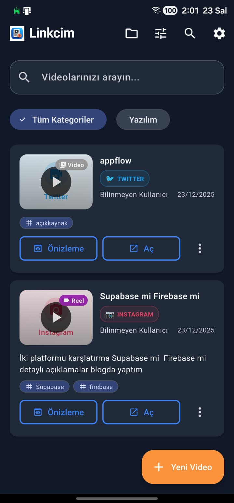
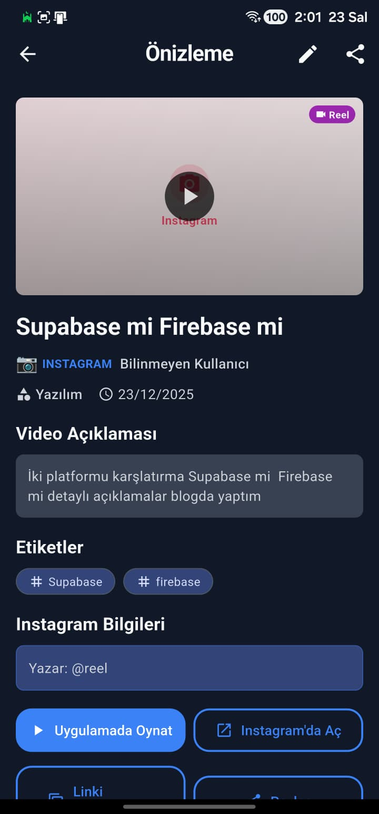
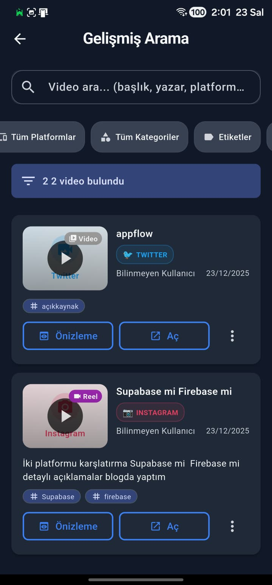
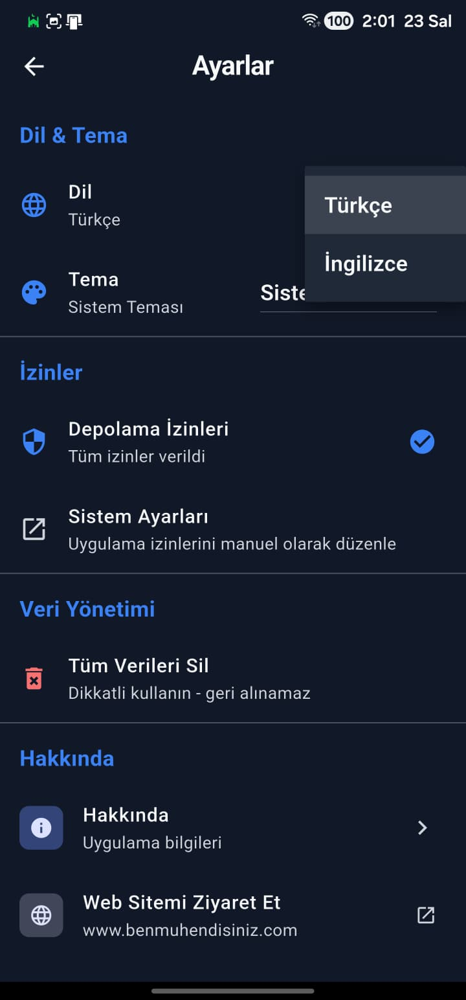

# 📱 Linkcim v1.0.0

<div align="center">


**🎬 Modern Video Organizasyon Uygulaması**

*Instagram, YouTube, TikTok, Twitter ve daha fazlası için güçlü video yönetim çözümü*

[](https://flutter.dev/)
[](https://developer.android.com/)
[](https://github.com/mehmetkaratslar/linkcim/releases)
[](LICENSE)

</div>

---

## 🌟 Neden Linkcim?

Linkcim, sosyal medya videolarınızı organize etmek, kategorize etmek ve kolayca erişmek için tasarlanmış modern bir uygulamadır. Yüzlerce video linkini kaybetmek yerine, hepsini tek bir yerde toplayın ve istediğiniz zaman bulun.

### ✨ Temel Özellikler

- 📱 **7 Farklı Platform Desteği** - Instagram, YouTube, TikTok, Twitter, Facebook, Vimeo, Reddit
- 📁 **Video Koleksiyonları** - Videolarınızı özel koleksiyonlara organize edin
- 🔍 **Gelişmiş Arama & Filtreleme** - Platform, kategori, etiket ve tarih filtreleri ile güçlü arama
- 🎨 **Modern Material Design 3** - Şık ve kullanıcı dostu arayüz
- 🌍 **Çoklu Dil Desteği** - Türkçe ve İngilizce
- 🌓 **Tema Desteği** - Açık, koyu ve sistem teması
- 🔒 **Güvenli Yerel Depolama** - Tüm verileriniz cihazınızda güvenle saklanır

---

## 🚀 Özellikler

### 📁 Video Koleksiyonları

Videolarınızı özel koleksiyonlara organize edin. İstediğiniz kadar koleksiyon oluşturun ve videolarınızı kategorize edin.

- ✅ Sınırsız koleksiyon oluşturma
- ✅ Videoları birden fazla koleksiyona ekleme
- ✅ Koleksiyonları düzenleme ve silme
- ✅ Favori koleksiyonlar işaretleme
- ✅ Koleksiyon bazlı hızlı erişim

### 🔍 Gelişmiş Arama ve Filtreleme

Güçlü arama sistemi ile videolarınızı anında bulun.

**Arama Özellikleri:**
- 📝 Metin araması (başlık, açıklama, yazar)
- 🎯 Platform filtresi (Instagram, YouTube, TikTok, vb.)
- 📂 Kategori filtresi
- 🏷️ Çoklu etiket filtresi
- 📅 Tarih aralığı filtresi

**Sıralama Seçenekleri:**
- ⏰ En yeni / En eski
- 🔤 Başlık (A-Z)
- 📱 Platform bazlı

### 🎨 Modern Kullanıcı Arayüzü

- **Material Design 3** ile modern ve şık tasarım
- **Responsive Layout** - Tüm ekran boyutlarında mükemmel görünüm
- **Smooth Animations** - Akıcı geçişler ve animasyonlar
- **Dark Mode** - Göz dostu koyu tema desteği
- **Custom Icons** - Özel ikonlar ve görseller

### 📱 Platform Metadata

Videolarınızı eklerken otomatik olarak platform bilgileri çekilir:

- 📺 **YouTube** - Video başlığı, kanal adı, thumbnail
- 📷 **Instagram** - Post bilgileri, kullanıcı adı
- 🎵 **TikTok** - Video detayları ve metadata
- 🐦 **Twitter** - Tweet bilgileri
- 📘 **Facebook** - Post metadata
- 🎬 **Vimeo** - Video detayları
- 🔴 **Reddit** - Post bilgileri

### 🏷️ Etiket ve Kategori Sistemi

- ✅ Özel kategoriler oluşturma
- ✅ Çoklu etiket ekleme (video başına 10 etiket)
- ✅ Etiket bazlı filtreleme
- ✅ Kategori bazlı organizasyon

### 🌍 Çoklu Dil Desteği

- 🇹🇷 Türkçe
- 🇬🇧 İngilizce
- 🔄 Uygulama içinden dil değiştirme

### 🌓 Tema Desteği

- ☀️ Açık Tema
- 🌙 Koyu Tema
- ⚙️ Sistem Teması (otomatik)

---

## 📸 Ekran Görüntüleri

<div align="center">

### Ana Sayfa


### Detay Sayfası


### Gelişmiş Arama


### Ayarlar Sekmesi


</div>

---

## 🚀 Kurulum

### 📱 Android APK Kurulumu

1. **GitHub Releases**'den en son APK'yı indirin:
   - [📥 Latest Release](https://github.com/mehmetkaratslar/linkcim/releases/latest)
   - En güncel versiyon: **Linkcim v1.0.0**

2. **APK'yı yükleyin:**
   - APK dosyasını cihazınıza indirin
   - Ayarlar > Güvenlik > Bilinmeyen Kaynaklardan yüklemeye izin verin
   - APK dosyasına tıklayarak yükleyin

### 🛠️ Geliştirici Kurulumu

```bash
# Repository'yi klonlayın
git clone https://github.com/mehmetkaratslar/linkcim.git

# Proje dizinine gidin
cd linkcim

# Bağımlılıkları yükleyin
flutter pub get

# Hive adapter'ları generate edin
flutter pub run build_runner build --delete-conflicting-outputs

# Uygulamayı çalıştırın
flutter run
```

---

## 🎯 Kullanım Kılavuzu

### 1️⃣ Video Ekleme

1. Ana sayfada **"+"** butonuna tıklayın
2. Video URL'sini yapıştırın (desteklenen platformlardan biri)
3. Başlık, kategori ve etiketleri girin (veya otomatik doldurulmasını bekleyin)
4. **Kaydet** butonuna tıklayın

### 2️⃣ Video Koleksiyonları

1. Ana sayfada **📁 Koleksiyonlar** butonuna tıklayın
2. **"+"** butonu ile yeni koleksiyon oluşturun
3. Video kartı menüsünden **"Koleksiyona Ekle"** seçeneğini kullanın
4. Videolarınızı istediğiniz koleksiyonlara ekleyin

### 3️⃣ Gelişmiş Arama

1. Ana sayfada **⚙️ Gelişmiş Arama** butonuna tıklayın
2. Metin araması yapın veya filtreleri kullanın:
   - Platform seçin
   - Kategori seçin
   - Etiket seçin
   - Tarih aralığı belirleyin
3. Sıralama seçeneğini belirleyin
4. Sonuçları görüntüleyin

### 4️⃣ Video Organizasyonu

- **Kategoriler**: Videolarınızı kategorilere ayırın
- **Etiketler**: Her videoya birden fazla etiket ekleyin
- **Koleksiyonlar**: Özel koleksiyonlar oluşturun
- **Arama**: Güçlü arama ile hızlıca bulun

---

## 🛡️ Güvenlik ve Gizlilik

- 🔒 **Yerel Depolama**: Tüm verileriniz cihazınızda güvenle saklanır
- 🚫 **Veri Paylaşımı Yok**: Kişisel bilgileriniz hiçbir yere gönderilmez
- 🔓 **Açık Kaynak**: Kod tamamen açık ve incelenebilir
- ✅ **İzin Yönetimi**: Sadece gerekli izinler istenir

---

## 🛠️ Teknik Detaylar

### Kullanılan Teknolojiler

- **Framework**: Flutter 3.0+
- **Dart SDK**: 3.0.0+
- **Veritabanı**: Hive (NoSQL)
- **State Management**: Provider
- **UI**: Material Design 3

### Platform Desteği

- ✅ Android
- ✅ iOS (yakında)
- ✅ Web (yakında)
- ✅ Windows (yakında)

### Performans

- ⚡ Hive veritabanı ile hızlı veri erişimi
- 🎯 Lazy loading ile optimize edilmiş liste görünümü
- 💾 Efficient caching mekanizması
- 🚀 Smooth animations ve transitions

---

## 🤝 Katkıda Bulunma

Katkılarınızı memnuniyetle karşılıyoruz! 🎉

1. ⭐ Repository'yi yıldızlayın
2. 🍴 Repository'yi fork edin
3. 🌿 Feature branch oluşturun (`git checkout -b feature/amazing-feature`)
4. 💾 Değişikliklerinizi commit edin (`git commit -m 'Add amazing feature'`)
5. 📤 Branch'inizi push edin (`git push origin feature/amazing-feature`)
6. 🔄 Pull Request oluşturun

---

## 📞 İletişim

<div align="center">

**Geliştirici**: Mehmet Karataş  
**Meslek**: Bilgisayar Mühendisi

🌐 [Web Sitem](https://www.benmuhendisiniz.com/)  
📧 [Email](mailto:mehmetkarataslar@gmail.com)  
💼 [GitHub](https://github.com/mehmetkaratslar)

</div>

---

<div align="center">

### ⭐ Projeyi beğendiyseniz yıldız vermeyi unutmayın!

**🚀 Linkcim ile videolarınızı organize edin ve kaybetmeyin!**

Made with ❤️ by [Mehmet Karataş](https://www.benmuhendisiniz.com/)

</div>
